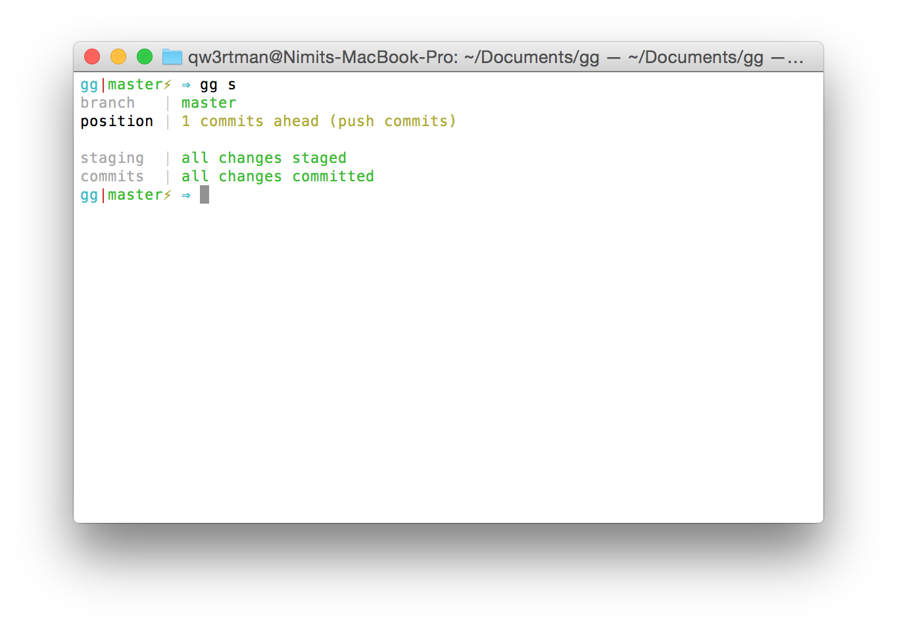
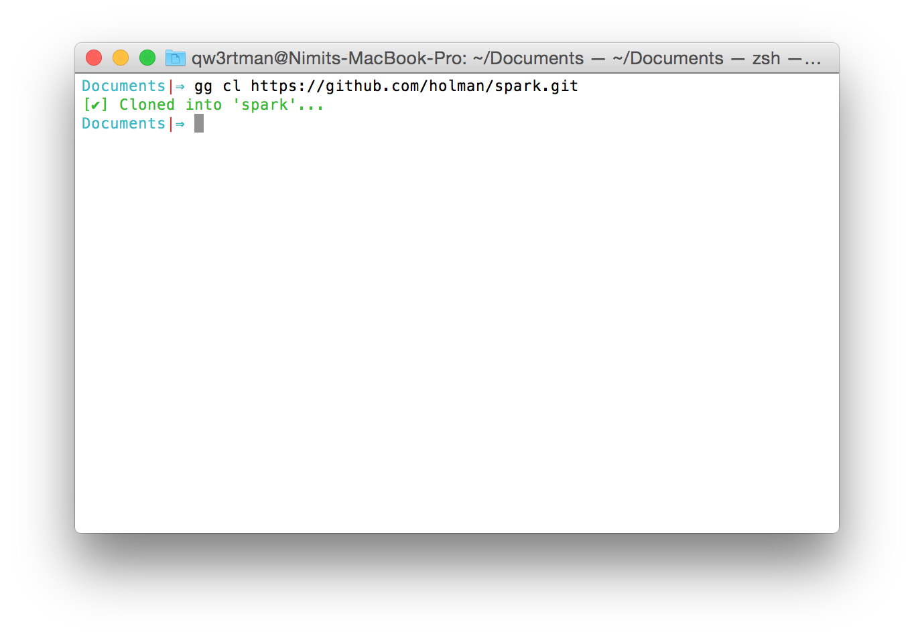
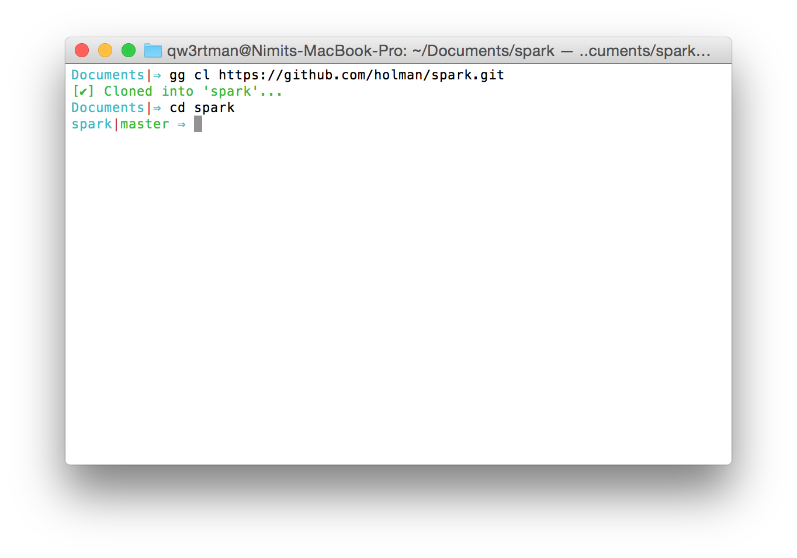
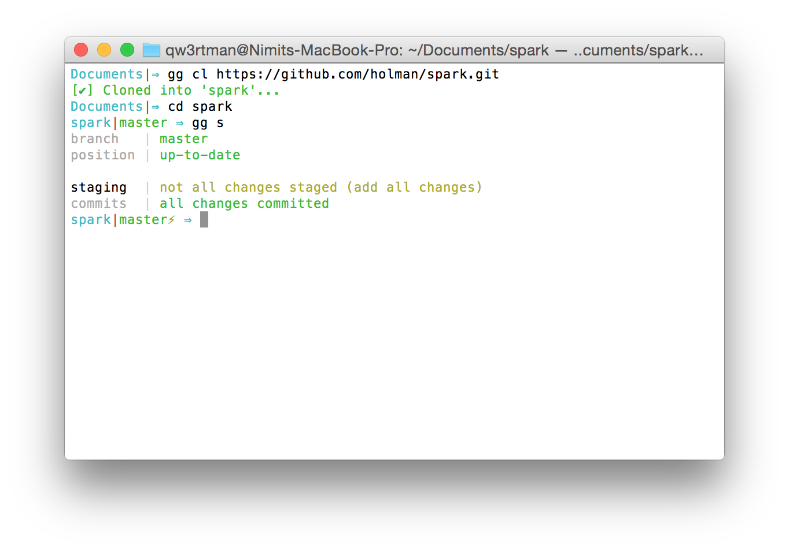
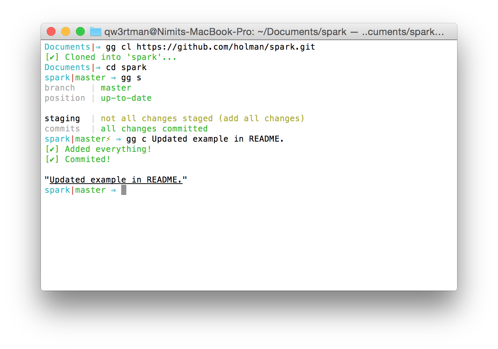
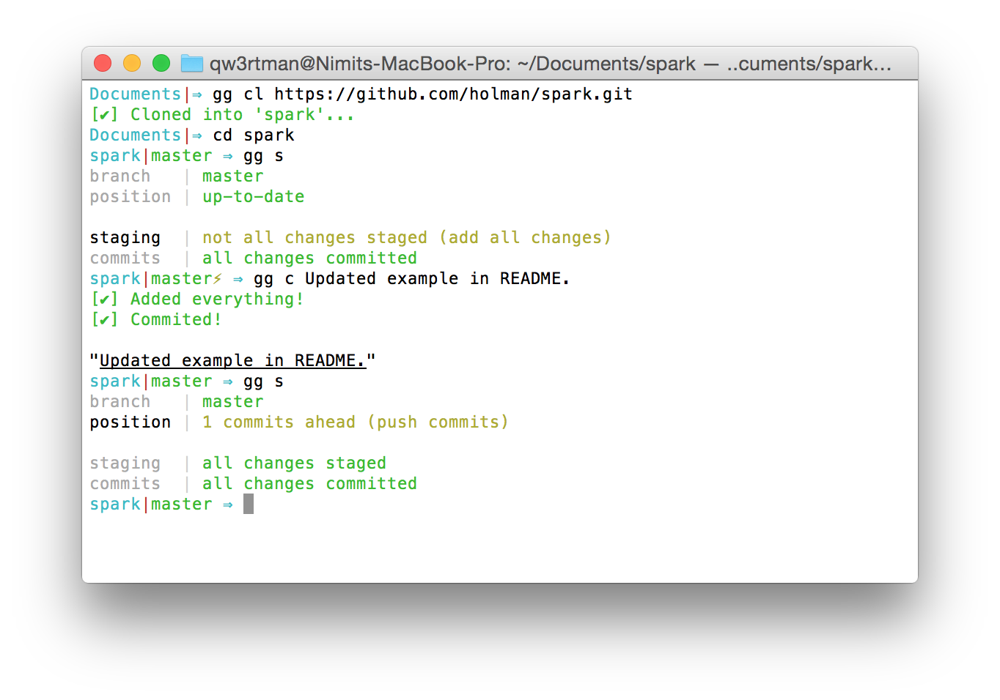

`gg`
==

the cookbook of git goodies

`gg` helps you *work with `git` more efficiently*, saving you keystrokes for your most prized projects.

Think of `gg` as a wrapper for the `git` commands that you run all the time.

## Getting Started
Suppose we want to clone the [awesome spark shell script (created by Zach Holman)](https://github.com/holman/spark).

Alright, let's switch into that directory.

After making a quick change, let's check the status of our clone.

Looks like we haven't staged our changes.

In the standard git workflow, we would have to `git add -A` and then `git commit -m "Updated example in README."`.

With `gg`, we can simply `gg c Updated example in README.` and we're good to go.

Let's check our clone's status again.

Looking good!
